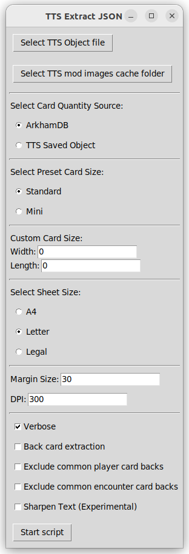

# SCED to PDF

## Requirements

1. Python must be installed.
2. The Python installation must include `tkinter`.
3. Install dependencies. `pip install -r requirements.txt`.

## Interface and Usage

*Tabletop Simulator abbreviated as TTS

1. In a console terminal, in the root directory of this project, begin by entering `python tts_extract_json.py` in the terminal.
2. Clicking on the "Select TTS Object file" button brings up a file selection window where you can choose a `.json` file. This file can be a saved deck of cards from Tabletop Simulator. For example, a deck of cards that was saved as an object. Or, the file can be any other .json file associated with TTS.
3. Clicking on the "Select TTS mod images cache folder" button brings up a folder selection window where you can choose a folder to function as an image cache. If you have TTS installed, you can actually select the same cache folder it uses for mods since the file name formatting of the script was designed to match the formatting of TTS. The selected cache folder is persistent, meaning that the script remembers the previously selected folder. The script will not work and will produce an error if you do not select a cache folder when running the script for the first time. Confirm that the correct directory path was created in the generated `cachepath.txt`. If, for some reason, you are using this but you do not have TTS, you can designate any folder as the cache folder.
4. There are two options for "Card Quantity Source", "ArkhamDB" or "TTS Saved Object". If the chosen option is "ArkhamDB", the quantity of duplicates of each card to be included in the output PDF will be based on the "quantity" key that is fetched for each card using the ArkhamDB publick REST API. If the chosen option is "TTS Saved Object", the quantity of duplicates of each card to be included in the output PDF is based on the actual quantity of duplicates of that card in the saved `.json` file representing the deck of cards.
5. There are two options for "Preset Card Size". You can choose either "Standard", which is the size of most AHLCG cards, or "Mini" which is short for "Mini American", which is the size of the investigator minis in AHLCG. These presets have been calculated for 300 dpi.
6. You can use the "Custom Card Size" to enter a custom size, in pixels, instead of any of the preset ones. If these fields are '0', they will not be used and the presets will be used. If these fields have values, the custom size will be used. A use case for this would be if you want to print using a dpi other than 300.
7. There are three options for paper sheet sizes: A4, Letter, and Legal.
8. You can enter your own margin size, in pixels, which is the size of the spacing in between cards. Note that the cards are always centered on the page as a group, which is why the margins for the edges of the paper are not specified. Or, you can use the default margin size of 30 pixels.
9. You can enter your own dots per inch (dpi), which is the resolution of the image when it is printed on paper. Or, you can use the default dpi of 300, which matches the preset "Standard" and "Mini" sizes.
10. The "Verbose" option toggles the amount of informational statements that are printed to the terminal console while the script is running.
11. The "Back card extraction" toggles whether the backs of cards will be included in the output.
12. The 'Exclude player card back' and 'Exclude encounter card back' options control whether the purple player card back or the yellow encounter card back, of each card, will be included in the output PDF.
13. When you are satisfied with all of your chosen options, you can press "Start Script" to begin producing your PDF. The GUI window will remain onscreen and automatically close once the script is done running. You can also follow along with the printed statements to the console, especially if the "Verbose" option is enabled. The generated file will be in the root directory of the project with the name `tts_extract_out.pdf`.

## Related Literature

A related project to this is [SCE Image Extractor](https://github.com/North101/sce_image_extractor).
